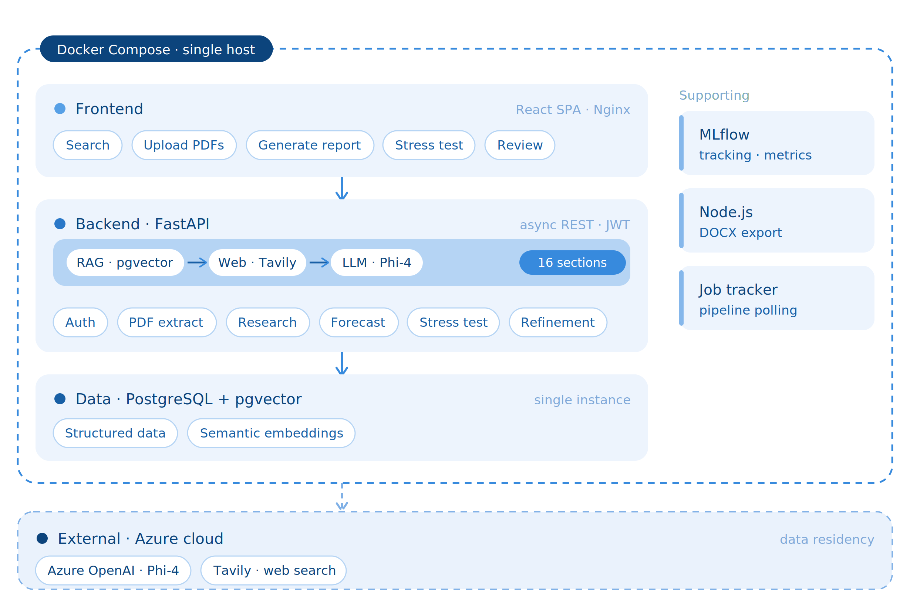
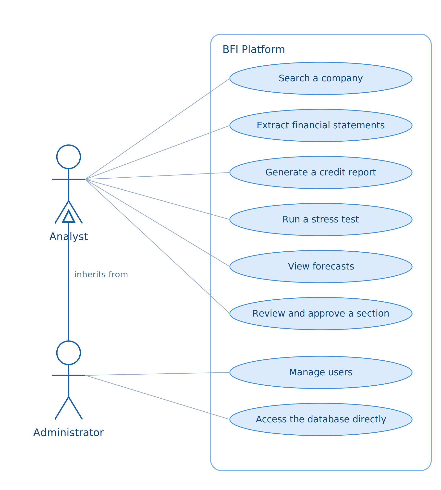
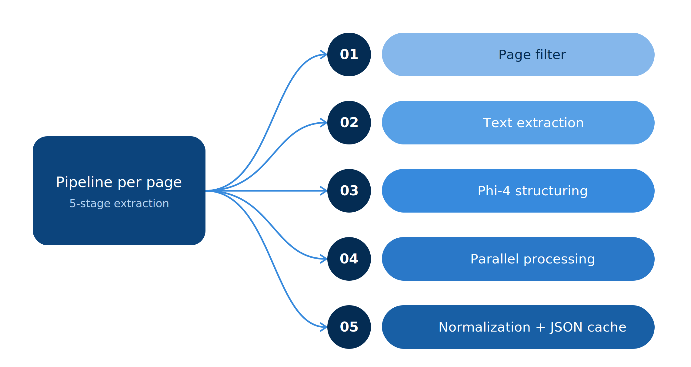
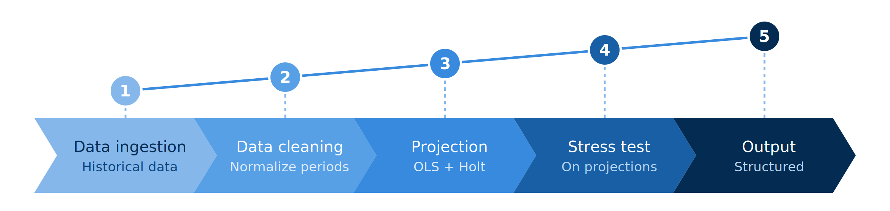
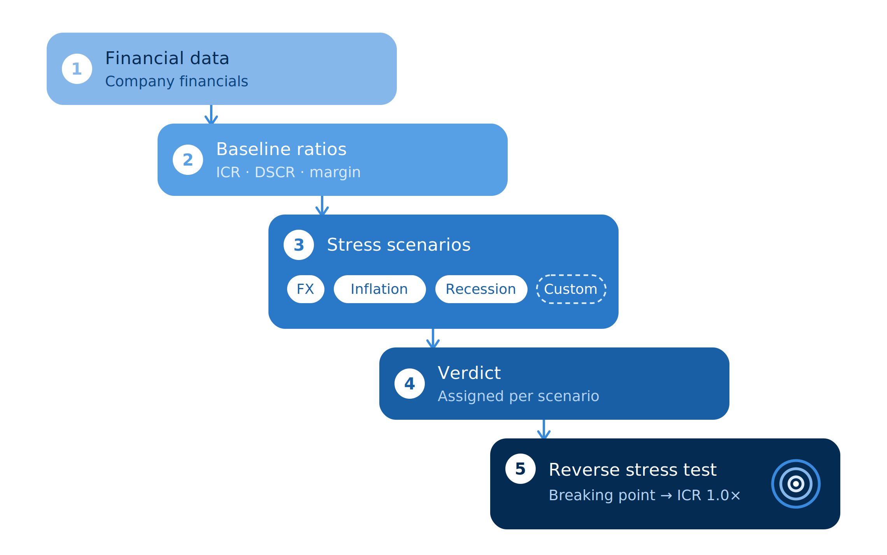
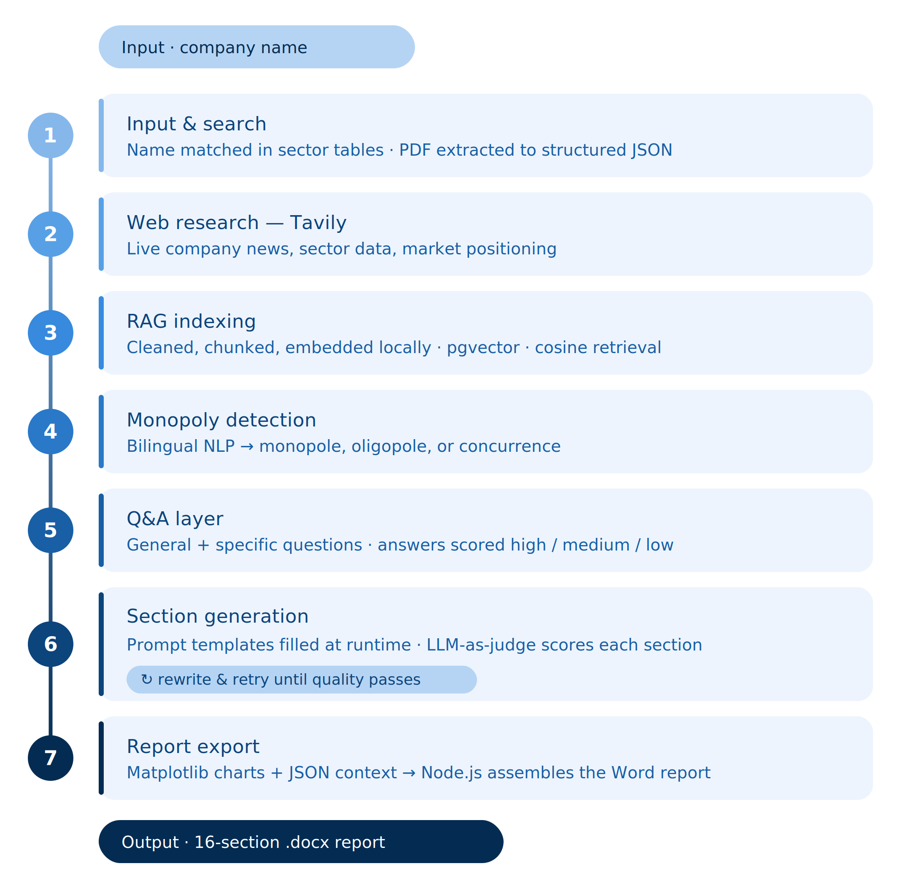
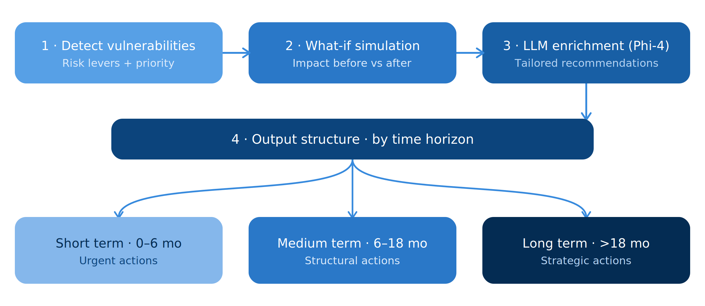
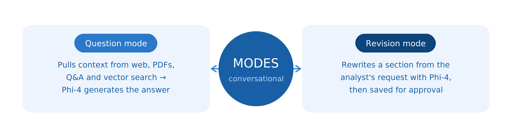

# BFI Credit Platform

An internal platform that automates the production of credit / benchmark analysis reports on Tunisian industrial companies. It replaces a manual, multi-day research and drafting process with a guided pipeline: upload a company's financial statements, and the system reads them, researches the company online, forecasts its financials, runs credit stress tests, drafts a full analyst report, and exports it as a formatted Word document — all reviewable and editable from a web dashboard.

## Architecture





## What it does

1. **Financial statement extraction** — Reads uploaded PDF financial statements (balance sheet, income statement, cash flow), locates the relevant pages, and extracts the tables into structured data. Uses text extraction (PyMuPDF / pdfplumber) with keyword pre-filtering to skip irrelevant pages, then an LLM-based OCR pass to parse tables into JSON.

   

2. **Company research** — Searches the web for company financials, recent news, governance/shareholders, stock listing (BVMT), export activity, and legal/regulatory risk via the [Tavily](https://tavily.com) search API, and cross-references an internal PostgreSQL database of Tunisian industrial companies for sector benchmarking.
3. **Financial forecasting** — Projects revenue, costs, and results forward using OLS regression, CAGR, and Holt double exponential smoothing.

   

4. **Credit stress testing** — Models the impact of scenario shocks (demand drop, rate hikes, FX swings) on a company's financial position, including reverse stress testing to find the breaking point.

   

5. **RAG-grounded report generation** — Cleans and semantically chunks all collected data (research findings + extracted financials), embeds it locally (sentence-transformers), and stores it in PostgreSQL via `pgvector`. Report sections are drafted by an LLM using retrieved context, then automatically graded against a completeness checklist and regenerated if the score is too low.

   

6. **Recommendations engine** — Detects a company's financial vulnerabilities, runs what-if simulations, and uses the LLM to generate tailored short/medium/long-term recommendations.

   

7. **Conversational refinement** — An in-dashboard assistant answers analyst questions using the RAG context (question mode) or rewrites a report section on request (revision mode), with changes saved for approval.

   

8. **Export & review** — Renders the final report as a Word document (`python-docx` / a Node.js `docx` generator) and exposes it through a React dashboard with job tracking, section version history, and refinement requests.

## Observability & infrastructure

- **MLflow** — every pipeline run (forecast, stress test, report generation) is logged as an experiment: model used, prompts, sources retrieved, and a faithfulness/hallucination score comparing generated text against its source context.
- **Laminar** — traces every LLM call in real time for debugging and latency/quality monitoring.
- **Docker Compose** — the full stack (FastAPI backend, React frontend, PostgreSQL/pgvector, MLflow server) runs as containers with health checks and auto-restart, deployable with a single command.
- **JWT authentication** — all API routes except health/login are protected by a bearer-token auth middleware.

## Tech stack

| Layer | Technology |
|---|---|
| Backend API | FastAPI (Python) |
| LLM | Azure AI Foundry (Phi-4) via OpenAI-compatible client |
| Web research | Tavily Search API |
| Embeddings / vector search | sentence-transformers + PostgreSQL `pgvector` |
| Forecasting | NumPy / SciPy (OLS, Holt smoothing) |
| PDF processing | PyMuPDF, pdfplumber, docling |
| Report export | python-docx, Node.js `docx` |
| Frontend | React (Vite) + Recharts |
| Experiment tracking | MLflow |
| Observability | Laminar |
| Database | PostgreSQL (pgvector extension) |
| Deployment | Docker Compose, Nginx |

## Project structure

```
backend/
├── core/            # config, logger, LLM/Tavily clients
├── routes/          # FastAPI route handlers (auth, research, forecast, stress test, pdf, jobs, dashboard)
├── services/         # business logic (extraction, embeddings, forecasting, stress testing, report generation, MLflow tracking)
├── schemas/          # Pydantic request/response models
├── frontend/          # React (Vite) dashboard
├── scripts/           # Node.js report generator
├── docker-compose.yml
├── Dockerfile.backend
├── Dockerfile.frontend
└── requirements.txt
```

## Getting started

### Prerequisites
- Docker & Docker Compose
- API keys: Azure AI Foundry (LLM), Tavily (web search), optionally Laminar (tracing)

### Setup

1. Copy `.env.example` to `.env` and fill in your credentials:
   ```bash
   cp .env.example .env
   ```
2. Start the stack:
   ```bash
   docker-compose up --build
   ```
3. Services:
   - Backend API: `http://localhost:8000` (docs at `/docs`)
   - Frontend: `http://localhost:3000`
   - MLflow UI: `http://localhost:5000`

### Running without Docker (development)

```bash
pip install -r requirements.txt
uvicorn main:app --reload --port 8000
```

```bash
cd frontend
npm install
npm run dev
```

## API overview

- `POST /api/research/deep-research` — run web research on a company
- `POST /api/research/generate-report` — generate a full report from database data
- `POST /api/research/generate-report-with-pdf` — generate a report from uploaded financial statement PDFs
- `GET /api/jobs/{job_id}` — track pipeline progress
- `GET /api/jobs/{job_id}/download` — download the generated Word report
- `POST /api/forecast/*` — financial forecasting endpoints
- `POST /api/stress-test/*` — stress testing endpoints
- `GET /api/dashboard/stats` — aggregated statistics

Full interactive API reference available at `/docs` once the backend is running.
